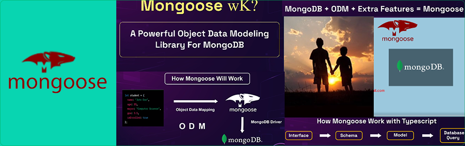

<p>
 <h1 style="color:red;" align="center">Mongoose Master</h1>
</p>


> ## Mission 2: Be A Mongoose Master

  ```sh
    mongoose start information:***new man***
    step 1:MongoDB Community Server Download
    step 2 :MongoDB Compass Download (GUI)
    step 3:new project file --^--
    npm init --y|tsc -- init
    npm install typescript --save-dev|npm install express --save
    npm install mongoose --save|npm i ts-node-dev
    npm install --save @types/express
    Package.json-----
   "scripts": {
    "dev": "ts-node-dev --rs --poll ./src/index.ts",
    "build": "tsc",
    "start": "node ./dist/index.js",
    "test": "echo \"Error: no test specified\" && exit 1"
    }
  ```
- Mongoose and Typescript basic server [✔Module 6+Basic server+(T,M)](https://github.com/julfiker755/mongoose-typescript-basic-server/tree/main)+ [✔Typescript+Mongoose server](https://github.com/julfiker755/typescript-mongoose-server/tree/main)
