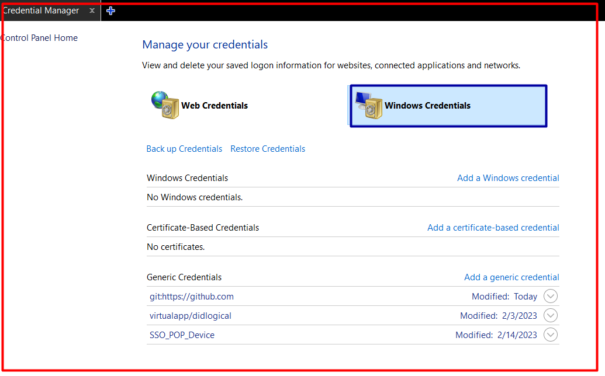
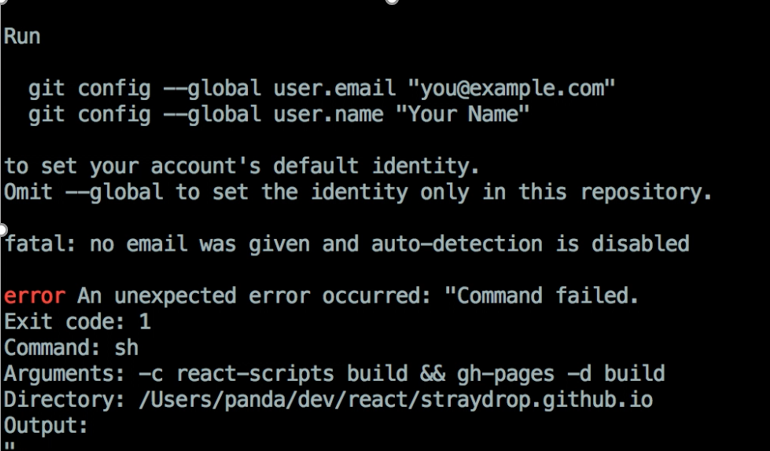
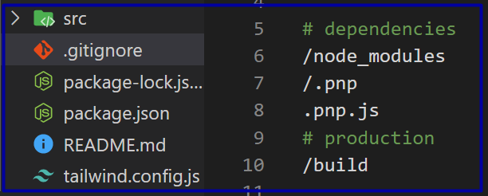
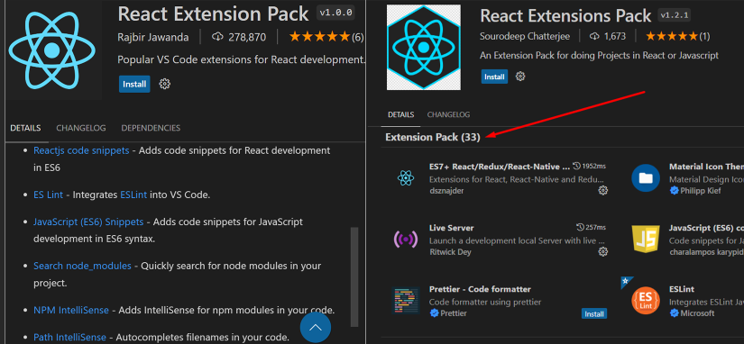
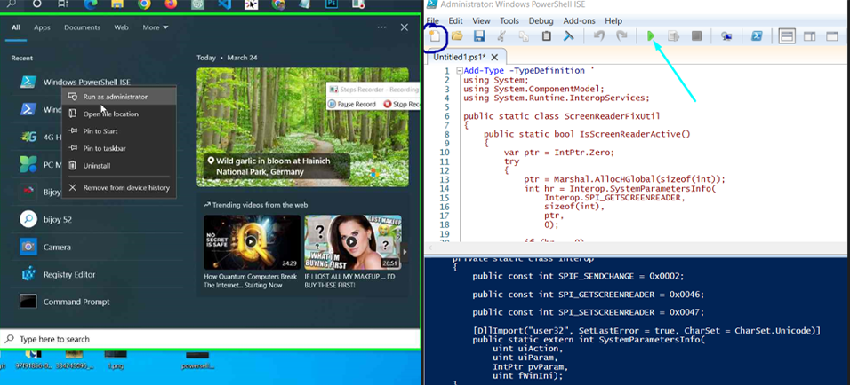

 <h1 style="color:red;" align="center">Git and Github 2023</h1>

### **গিটহাব কি ?**
GitHub সংস্করণ নিয়ন্ত্রণ এবং সহযোগিতার জন্য একটি ওয়েব-ভিত্তিক প্ল্যাটফর্ম যা গিট ব্যবহার করে, একটি বিতরণ করা সংস্করণ নিয়ন্ত্রণ ব্যবস্থা। এটি সফ্টওয়্যার কোড হোস্টিং এবং শেয়ার করার পাশাপাশি সফ্টওয়্যার প্রকল্প পরিচালনা এবং কোড বিকাশে অন্যদের সাথে সহযোগিতা করার জন্য একটি জনপ্রিয় প্ল্যাটফর্ম।
#

1. গিট্  কমিট  নিয়ে  একটু  আলোচনা  কেন  মিনিং ফুল  কমিটি  জরুরি ?
2. কিভাবে পূর্বের স্টেজ এ যাওয়া  যাই এবং  কমিট  রিসেট  করা যাই git reset HEAD~
3. ডিলিট  হয়ে  যাওয়া স্টেজের  ফাইল  কিভাবে  ফিরে পাওয়া যাই ? git reset --hard
4. অরিজিন  ইউআরএল  এবং  রিপোজিটরি ইউআরএল  এর  মধ্যে  পার্থক্য ?
5. কিভাবে  একটা  প্রজেক্ট  এ অরিজিন  চেঞ্জ  করে  অন্য  একটা  প্রজেক্ট এর  অরিজিন  অ্যাড করে  পুশ  করা  যাই 
git remote remove origin
6. গিটহাব এ লাইভ  সাইট কিভাবে  হোস্টিং  করতে  হয়  ?
7. ইমেজ  এর  পাথ  কেসসেনসিটিভ এর  ব্যাপার  গিট্ চ্যালেঞ্জ ১ ?
8. আপনাদের  কাজ  হবে  এই  প্রজেক্ট  টা  গিটহাব  থেকে  ক্লোন  করে  হালকা  কিছু  চেঞ্জ  করে  আপনি আপনার  গিটহাব এ  নতুন  একটা  রিপোজিটরি  তৈরী  করে সেইখানে  পুশ  করবেন 
9. যদি  দুইটা  গিটহাব  একাউন্ট  থাকে  তাহলে  একটা  একাউন্ট  কিভাবে  উইন্ডোস ক্রেডিনশিয়াল থেকে  রিমোভ করতে হয় ?

10. SSH এবং  https  অরিজিন  এর  পার্থক্য 
11. একই  প্রজেক্ট  কিভাবে  দুইটা  রিপোজিটরিতে  পুশ  করতে  হয় ?
12. গিটহাব রিজেক্টেড এরর  যদি  আমরা  গিটহাব  থেকে  কিছু   চেঞ্জ করি  এবং  পরে  আবার  পুশ  করলে  গেলে  এরর  দেয়  এইটা কিভাবে  সল্ভড  করতে   পারি 
13. গিটহাব  কিভাবে  নতুন  করে  ইমেইল  এবং  উজারনেম সেট  করতে  হয়  অনেকেই  উইন্ডস দিলে  এই  ঝেমেলায়  পরে 
 - git config --global user.name "John Doe"
 - git config --global user.email "johndoe@example.com"
 

#
> ## **Fast time push**
- …or create a new repository on the command line
- echo "# simple" >> README.md
- git init
- git add .
- git commit -m "first commit"
- git branch -M main
- git remote add origin https://github.com/julfiker755/simple.git
- git push -u origin main
> ## **Second time** 
- git add .
- git commit -m "first commit"
- git push -u

> ## **Origin Https Change**
1. git remote remove origin
2. git remote add origin https://github.com/ProgrammingHero1/redux-cart.git
3. git push --set-upstream origin main
4. git push --set-upstream origin main -f

> ## **Origin diya download**
- git clone https://github.com/ProgrammingHero1/redux-cart.git

> ## Markdown
- Readme file ta dekte caile…………….
- clt+shift+P and Markdown:Open Preview(clt+Shit+V)
- Markdown main Wepsite link:-*[Markdown Cheat Sheet link](https://www.markdownguide.org/cheat-sheet/#overview)*
> ## Git Branch Commands
| Command | Description |
| ----------- | ------------ |
| git branch | List branches (the asterisk denotes the current branch) |
| git branch [branch name] | Create a new branch |
| git branch -d [branch name]| Delete a branch |
| git branch [branch name] | Create a new branch |
| git checkout -b [branch name] | Create a new branch and switch to it |
| git checkout - | Switch to the branch last checked out |
| git checkout [branch name] | Switch to a branch |
|
---> Git Branch Commands Wepsite link:-*[Git Branch Com](https://github.com/joshnh/Git-Commands)*
> ## What is Gitignore
- কোন ফাইলকে গিটহাবে পাঠাতে না  চাইলে আমরা .gitignore  ব্যবহার করি

> ## Visual Studio Code Extension
- Visual Studio Code extension
  - Live Server
  - css-auto-prefix
  - Monokai Dark Soda(color change)/Flatland Monokai Theme
  - Material Icon Theme/Theme - Seti-Monokai
  - Code Spell Checker(English check banna vull)
  - Better Comments
  - RapidAPI Client
- react js extension
  - Reactjs code snippets-(rsc,rfc)
  - react emmet{settings->extensition->Include Languages}=add korte hobe
  - Auto Import
  - Redux DevTools
  - React Extension Pack
  - Axios Snippets
- vs code figma file open (Easy solutions)
  - Figma for VS Code
- tawild css extenstion
  - Tailwind CSS IntelliSense
  - Inline fold
- react js one file extension
  - React Extension Pack
  - React Extensions Pack
 
> ## Brower Extensition
- Brower Extension most important
  - Copyfish (selct kore copy koro)
  - GoFullPage (full page pdf,jpg,png kora)
  - Pesticide for Chrome (website ke select kora)
> PowerShell Not working
- Powershell Warning
  - PowerShell detected that you might be using a screen reader and has disabled PSReadLine for compatibility purposes.
  - PowerShell detected that you might be using a screen reader and has disabled PSReaLine for compatibility pur poses.If you want to re-enable it,run 'Import-Module PSReadLine'.
  
Powershell Sloved Link:: [Stack Exchange](https://serverfault.com/questions/1014754/cause-of-warning-powershell-detected-that-you-might-be-using-a-screen-reader-an).
- Example Image

Javascript Books All Resources:: [Book](https://with.zonayed.me).
