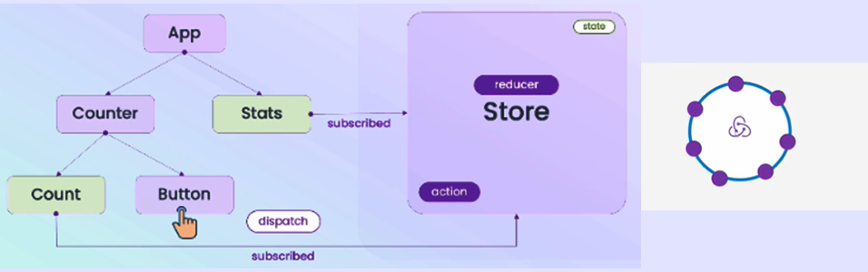

<!-- PROJECT LOGO -->
 

    <h1 align="center">Module 1 - Redux Fundamentals</h1>

- What is Reuux?
  - Redux is a state management tool
  - Redux is a flexible State Container for JavaScript Apps  that manages our application state separately
  - রিডাক্স  স্টেট  কে  কনটেন্ট  করে  রাখে। রিডাক্স স্টেটকে কনটেন্ট  করে  রাখে  বলে  তাকে   স্টেট  কন্টেইনার  বলা  হয়। জাভাস্ক্রিপ্ট দিয়া তৈরি  করা  একটি  লাইব্রেরি।

> ## How Redux Store works and react js expletion
 

- Reducer ধর্ম
  - পিওর ফাংশন ব্যবহার করতে হবে। পিওর ফাংশন নিজের কাজ ছাড়া অন্য কোন কাজ করবে না। বাইরের কোন জিনিস পরিবর্তন করতে পারবে না।
